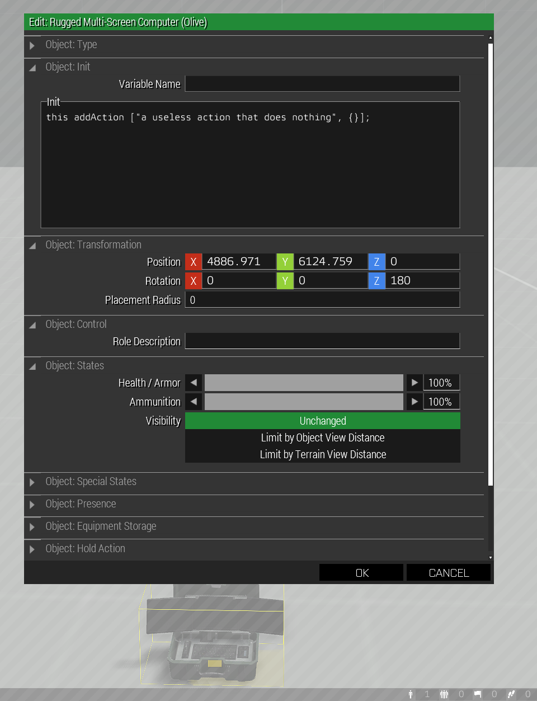
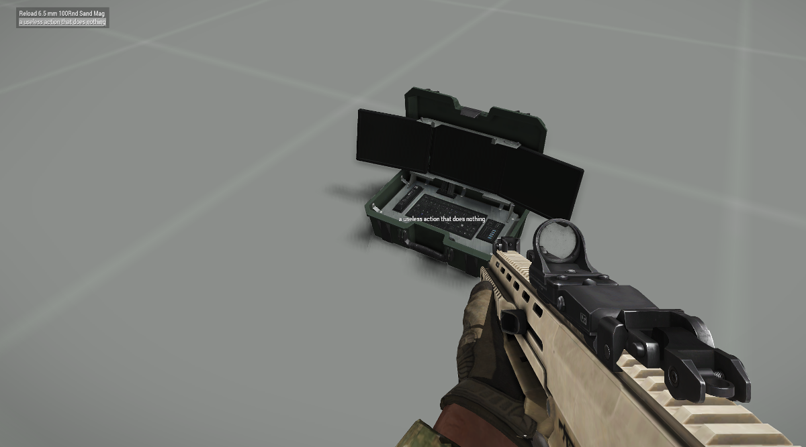

# Adding Action to Object

```SQF
this addAction ["Name of your action", {// code for your action ... what it does}];
```

This is just an event handler that is displayed by player proximity.
```SQF
this addAction 
[
    "Action Title Text", // what you want your player to see in their action menu
    { /* code */ } // what you want your action to do when the player selects it in the menu
];
```

Add it to the object's init field in the editor.  Here we are adding it to a computer.
  

Here we see it availabe as an action to the player.
  

See the community wiki for 
[more details](https://community.bistudio.com/wiki/addAction).