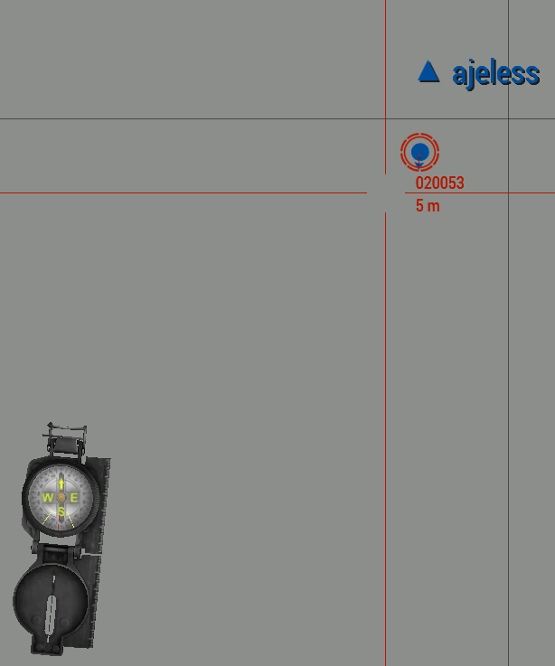

# Player Tracking Marker

This code creates a marker that follows the player around on the map. Either wrap it in a spawn call or use execVM to call it from another script.

```SQF
[] spawn (
	_playerTrackerMarker = createMarker [format ["%1", name player], player];
	_playerTrackerMarker setMarkerColor "ColorWest";
	_playerTrackerMarker setMarkerType "mil_triangle";
	_playerTrackerMarker setMarkerText name player;
	while {!isNull player} do {
		sleep 1;
		_playerTrackerMarker setMarkerPos player;
	};
);
```

