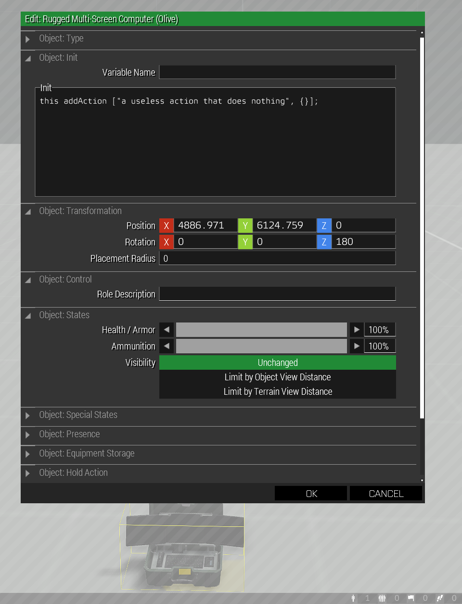
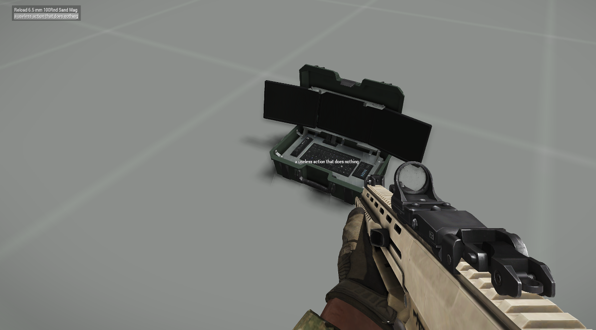

# Add Action

```SQF
this addAction ["Name of your action", {// code for your action ... what it does}];
```

## Add It To Object's Init Field
```SQF
this addAction 
[
    "Action Title Text", // what you want your player to see in their action menu
    { /* code */ } // what you want your action to do when the player selects it in the menu
];
```  
  

## Available as Player Action  
  

See the community wiki for 
[more details](https://community.bistudio.com/wiki/addAction).