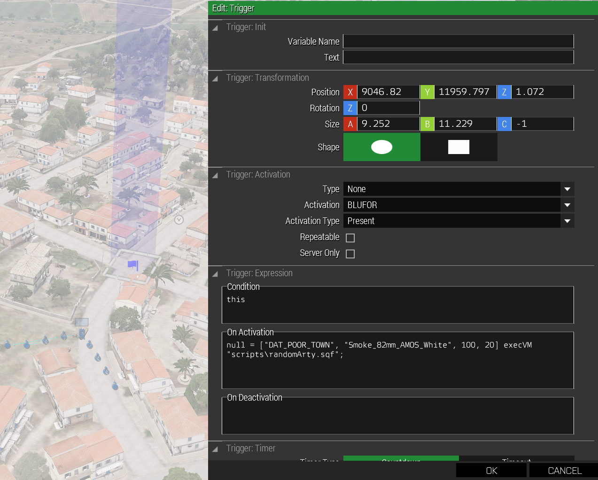

# Drop Object - Triggered

Example of how to use a trigger to call a script to drop random artillery/bombs on a position inside a marker area.

## Dependencies
scripts\randomarty.sqf

```bash
mission_root_directory\
    |-scripts\
        |-randomArty.sqf
```

## randomArty.sqf
```SQF
params ["_markerArea", "_shellClass", "_numberOfShells", "_maxDelayBetweenShells"];

for "_i" from 1 to _numberOfShells do { 
	// Get the random position of a shell within the marker area and raise it 100 meters.
	private _3dPos = [[_markerArea]] call BIS_fnc_randomPos;
	_3dPos set [2, 100];

	// Create the shell at that position
	private _shell = _shellClass createVehicle _3dPos;

	// Give it a push towards the ground
	_shell setvelocity [0,0,-150];

	// Random delay between artillery shells
	sleep random _maxDelayBetweenShells;
};
```

## How To Use It
* Create a folder called scripts and file called randomArty.sqf inside your mission.
* Slap a marker down and give it a variable name.
* In the trigger's 'On Activation' field type the following:
```SQF
null = ["DAT_POOR_TOWN", "Bo_Mk82", 100, 10] execVM "scripts\randomArty.sqf";
```

This drops 100 Bo_Mk82 bombs on the " DAT_POOR_TOWN " marker area with a max delay of 10 seconds between shells.

## Arguments
["DAT_POOR_TOWN", "Bo_Mk82", 100, 10]  
["_markerArea", "_shellClass", _numberOfShells, _maxDelayBetweenShells];  

That should be self explanatory, but the in case it's not:

**_markerArea** The variable name of your marker.

**_shellClass** The ammo class, not the magazine class, from: https://community.bistudio.com/wiki/Arma_3_CfgMagazines

**_numberOfShells** How many shells in the barrage

**_maxDelayBetweenShells** Random delay (seconds) between shells in barrage. Maximum delay.


